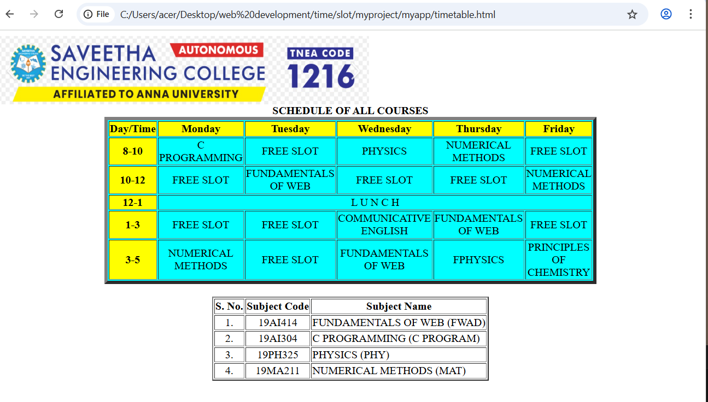

# Ex02 Time Table
## Date:28/12/2025

## AIM
To write a html webpage page to display your slot timetable.

## ALGORITHM
### STEP 1
Create a Django-admin Interface.

### STEP 2
Create an App inside the Django project.

### STEP 2
Create a static folder uder the created App and insert HTML code.

### STEP 3
Create a simple table using ```<table>``` tag in html with the relevant attributes.

### STEP 4
Add rows using ```<tr>``` tag.

### STEP 5
Add your course schedule using ```<td>``` tag.

### STEP 6
Execute the program using runserver command.

## PROGRAM
```
<html>
<head>
<title> Course Schedule </title>
</head>
<body>

<table align="center" width="540" 
border="5" bgcolor="cyan">
<caption><b>SCHEDULE OF ALL COURSES</b></caption>
<tr align="center">
<th bgcolor="yellow">Day/Time</th>
<th bgcolor="yellow">Monday</th>
<th bgcolor="yellow">Tuesday</th>
<th bgcolor="yellow">Wednesday</th>
<th bgcolor="yellow">Thursday</th>
<th bgcolor="yellow">Friday</th>
</tr>
<tr align="center">
<th bgcolor="yellow">8-10</th>
<td >C PROGRAMMING</td>
<td>FREE SLOT</td>
<td>PHYSICS </td>
<td>NUMERICAL METHODS</td>
<td>FREE SLOT</td>
</tr>
<tr align="center">
<th bgcolor="yellow">10-12</th>
<td>FREE SLOT</td>
<td> FUNDAMENTALS OF WEB </td>
<td>FREE SLOT</td>
<td>FREE SLOT</td>
<td>NUMERICAL METHODS</td>
</tr>
<tr>
<th bgcolor="yellow">12-1</th>
<td colspan="5" align="center">L U N C H</td>
</tr>
<tr align="center">
<th bgcolor="yellow">1-3</th>
<td >FREE SLOT </td>
<td>FREE SLOT</td>
<td>COMMUNICATIVE ENGLISH</td>
<td>FUNDAMENTALS OF WEB</td>
<td>FREE SLOT</td>
</tr>
<tr align="center">
<th bgcolor="yellow">3-5</th>
<td>NUMERICAL METHODS</td>
<td>FREE SLOT</td>
<td>FUNDAMENTALS OF WEB</td>
<td>FPHYSICS</td>
<td>PRINCIPLES OF CHEMISTRY</td>
</tr>
</table>
<br>
<table align="center"  border="2">
<tr align="center">
<th>S. No.</th>
<th>Subject Code</th>
<th>Subject Name</th>
</tr>
<tr>
<td align="center">1.</td>
<td align="center">19AI414</td>
<td>FUNDAMENTALS OF WEB (FWAD)</td>
</tr>
<tr>
<td align="center">2.</td>
<td align="center">19AI304</td>
<td>C PROGRAMMING (C PROGRAM)</td>
</tr>
<tr>
<td align="center">3.</td>
<td align="center">19PH325</td>
<td> PHYSICS (PHY)</td>
</tr>
<tr>
<td align="center">4.</td>
<td align="center">19MA211</td>
<td>NUMERICAL METHODS (MAT)</td>
</tr>
</table>
</body> </html>
```

## OUTPUT



## RESULT
The program for creating slot timetable using basic HTML tags is executed successfully.


[def]: image.png
[def2]: image-1.png
